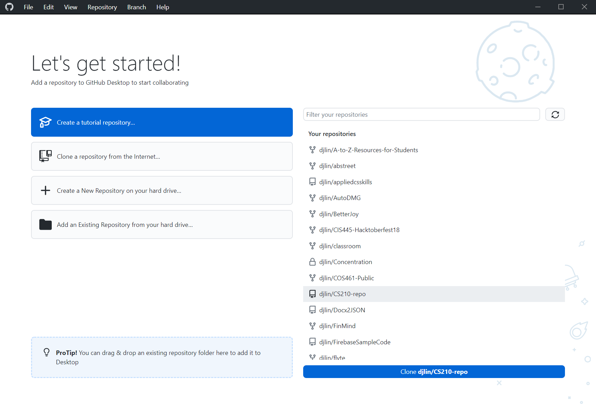
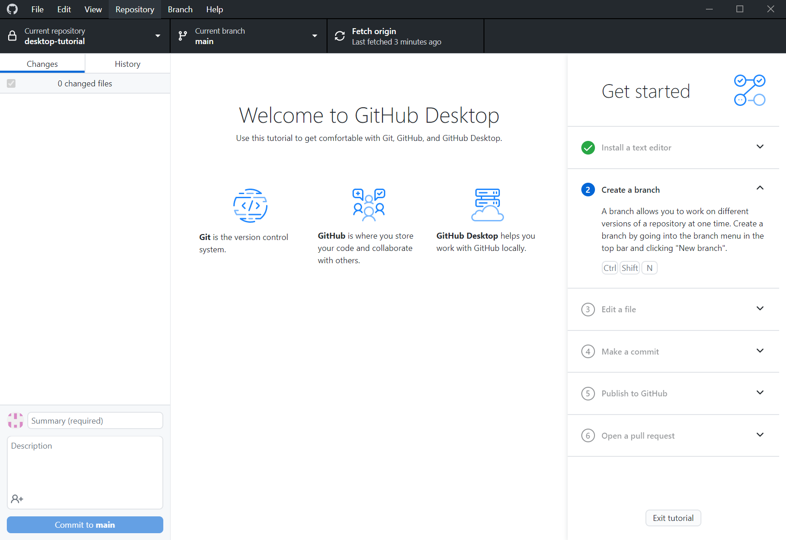
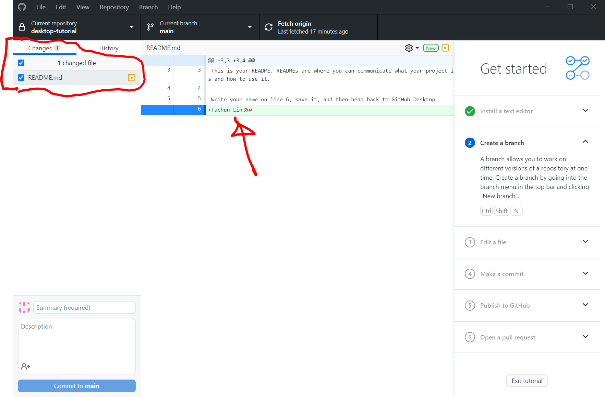
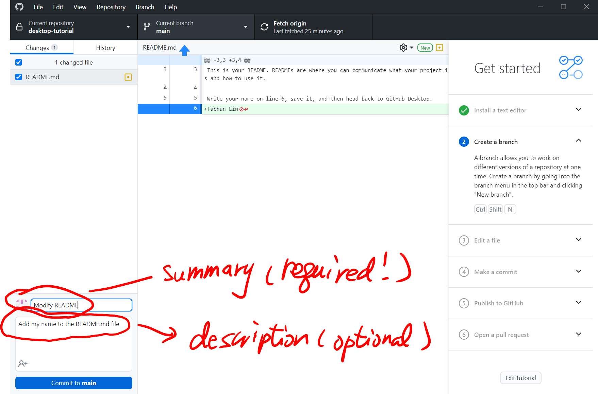
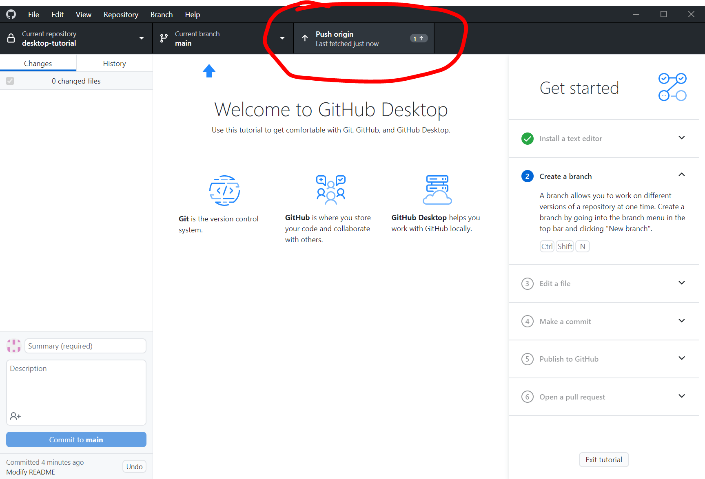
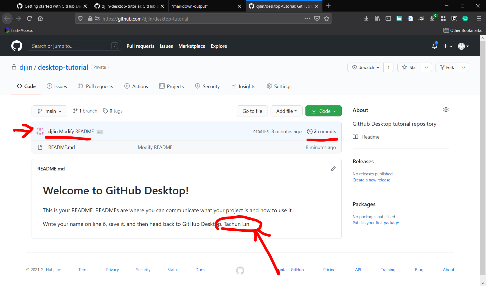
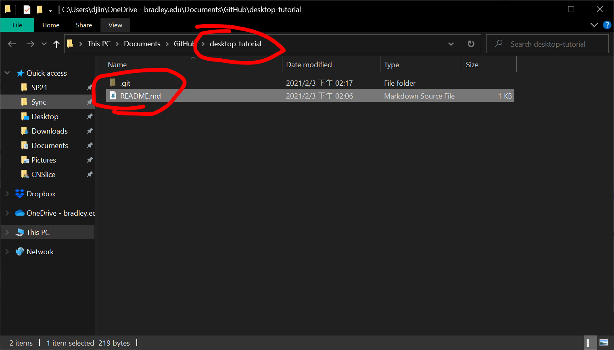
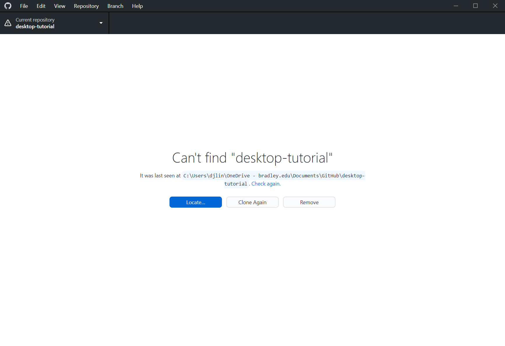
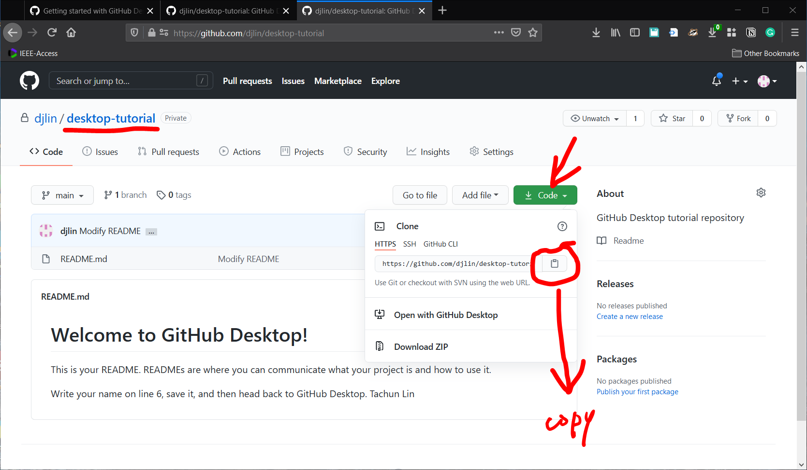
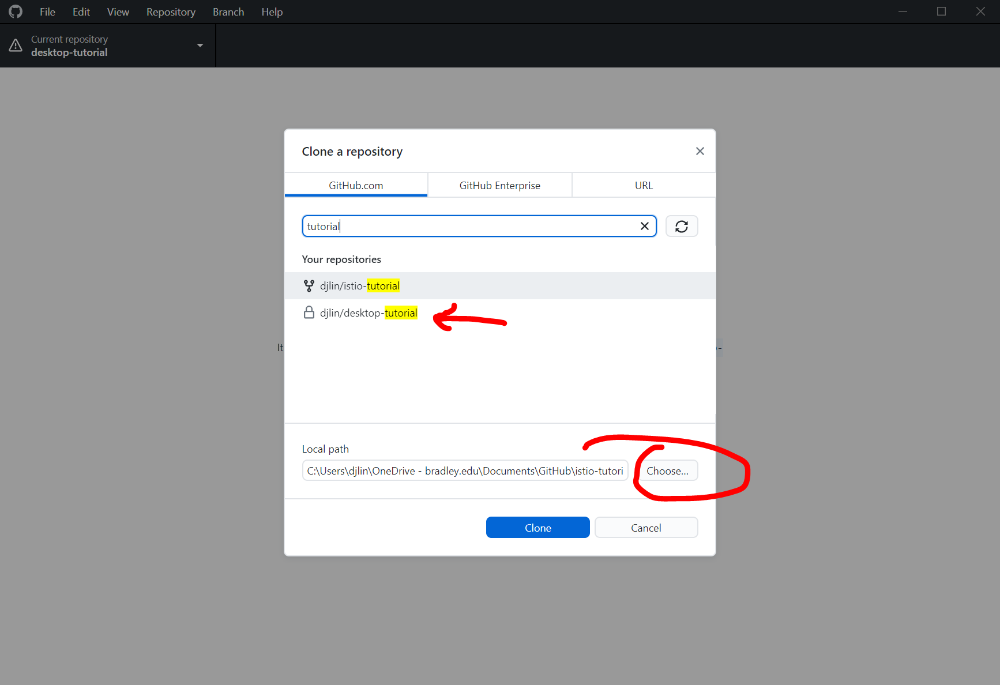

# Git and GitHub Tutorial

In this tutorial, we'll learn how to use [Git](https://git-scm.com/) and [GitHub](https://github.com/) through the IDE [GitHub Desktop](https://desktop.github.com/).

## What are Git and GitHub?

**Git is a free and open source distributed version control system designed to handle everything from small to very large projects with speed and efficiency.**

**Millions of developers and companies build, ship, and maintain their software on GitHub ¡X the largest and most advanced development platform in the world.**

Everyone should learn Git and GitHub. So, let's get started.

## 1. Watch the four videos [here](https://git-scm.com/doc)

   * [What is Version Control?](https://git-scm.com/video/what-is-version-control)
   * [What is Git?](https://git-scm.com/video/what-is-git)
   * [Get Going with Git](https://git-scm.com/video/get-going)
   * [Quick Wins with Git](https://git-scm.com/video/quick-wins)

## 2. To learn Git commands, you are strongly encouraged to do the exercises in [Git Immersion](https://gitimmersion.com/)

A few commands you should learn from the exercises

  * git add
  * git commit
  * git status
  * git log
  * git diff
  * git clone
  * git checkout
  * git branch

## 3. Note: You cannot completely replace Git with GitHub Desktop as not all functions/features are implemented in GitHub Desktop. So, I would strongly encourage you to learn the Git commands.

However, I know many of you prefer to use GUI. So, let's learn how to use GitHub Desktop.

### 3.1. Install [Git](https://git-scm.com/) and [GitHub Desktop](https://desktop.github.com/)

### 3.2. Create an account on [GitHub](https://github.com/). Here, I would encounrage you to create an account with your university e-mail address.

You can get the [GitHub Student Developer Pack](https://education.github.com/pack)

### 3.3. Follow the instructions in Parts 1 and 2 of [Getting started with GitHub Desktop](https://docs.github.com/en/desktop/installing-and-configuring-github-desktop/getting-started-with-github-desktop) to authenticate and configure GitHub Desktop.

## 4. Under the GitHub Desktop interface, you have four options.

### 4.1. First, try out the functions with the first option - "Create a tutorial repository..."

### 4.2. A repository has be successfully created both locally (on your machine) and remotely (on GitHub.com).

* You can find the local repository through the menu options **Repository -> Show in Explorer**
* You can find the remote repositoty through the menu options **Repository -> View on GitHub**

* **Key concept**: the local and repositories are **NOT synchronized automatically**. Whenever you make changes to the files, those changes only happen to those under the local repository. This way, many (thousands of) people can work on the same repository simultaneously without interfering the others' work.

### 4.3. Now, open the folder of the repository on your local machine. You can see a **README.md** file and a **.git** folder.

* **Key concept**: __NEVER__ touch the **.git** folder -- unless you know what you are doing.

#### 4.3.1. Use any editor to modify the README.md file. Add your name on line 6 and save it.

#### 4.3.2. You may observe now that GitHub Desktop shows the changes you made.

#### 4.3.3. To keep a **PERMANENT** copy of the changes you made into the **LOCAL** repository, let's **COMMIT** the changes.

Enter the **Summary** (and a description of the changes), then click the **Commit** button.

#### 4.3.4. Once the commit is done successfully, the changes have been recorded in the local repository on your machine.

At this point, your local repository and the one on GitHub are **different**. If your harddrive crashes now, you still lose the changes you made to the file. In order to use GitHub as a backup, you need to **synchronize** the local repository to the remote one.

**Key concept**: again, the local and remote repositories will NOT synchronize automatically.

#### 4.3.5. Let's **PUSH** the changes to GitHub by clicking the **Push button**.

#### 4.3.6. Now, check if the changes are successfully uploaded to GitHub.

Use the menu option **Repository -> View on GitHub** 

You can observe that the name you added to the file on your local machine is also reflected in the GitHub repository.

Other things you can observe/check.

* **djlin Modify README**: here, djlin is my ID, and "Modify README" is the summary I entered in the previous step 
* **2 commits**: click on it, and you'll see that we have made 2 commits to the repository so far. 

**Key concept**: Feel free to commit __as many times as you want__. You can use the commits to go back and forth among all different versions of the program/project/file.

**As a software engineer**: you will commit the changes you make regularly throughout the day. For example, after you complete one function (big or small), you'll commit the changes to your local repository. You will **NOT** wait till you finish the whole program and then commit. Also, pretty much every company practices [**Continuous Integration/Continuous Delivery (CI/CD)**](https://www.infoworld.com/article/3271126/what-is-cicd-continuous-integration-and-continuous-delivery-explained.html). Before you take off from work, you should make sure that your code can be successfully integrated into the company's (sub)system or the part you are working on. ==> There should be NO ERRORS.

## 5. At this point, the repository on GitHub has the latest update. And it is SAFE even if the harddrive on your computer crashes.

### 5.1. Let's now *DELETE* the local repository on your machine.

#### 5.1.1. In GitHub Desktop menu, **Repository -> Show in Explorer** to find the folder of the local repository.

Close the GitHub Desktop App.

Now, delete the whole *desktop-tutorial** folder

#### 5.1.2. Ouch, we lost everything...

NO worries. Let's recover the repository from GitHub.

#### 5.1.3. Go to the GitHub page of the **desktop-tutorial** repository

Click **Code** (the green button), then click the **copy** button next to the **https://github.com/...***

#### 5.1.4. Back to the GitHub Desktop, and use the menu options **File -> Clone repository**

* You have at least two ways to get the repository back to your computer

1. Since the GitHub Desktop is connected to your GitHub account, you can **filter** the repository by enter the keyword **tutorial**

Now, select/click the **[your id]/desktop-tutorial** option and determine where you will save the repository on your machine.

2. The other way to **CLONE** the remote repository to your machine, you can use the **URL** option

Recall that we **copied** the URL in Step 5.1.3. Now, paste the URL. (If necessary, repeat Step 5.1.3. to get the URL and paste here.)

3. After either one of the above, you click **Clone** to retrieve the whole repository from GitHub to your machine.

## 6. TADA! We get everything back!

## Takeaway

1. **Commit** *regularly* to your local repository
2. If you work on your **personaly project**, feel free to **push** the changes to GitHub.
3. Instead, if you  work on a **group project**, you should be more selective and **only push completed and working function/feature/code** to GitHub. Otherwise, your changes may break the whole system/project/etc. And you know the consequences would not be pretty...

## Q&A

Contact me if you get stuck in any of the steps, find errors in this tutorial, or have any questions.

## Git/GitHub References

* [Getting started with GitHub Desktop](https://docs.github.com/en/desktop/installing-and-configuring-github-desktop/getting-started-with-github-desktop)
* [Pro Git(e-book)](https://git-scm.com/book/en/v2)
* [Git Reference](https://git-scm.com/docs)
